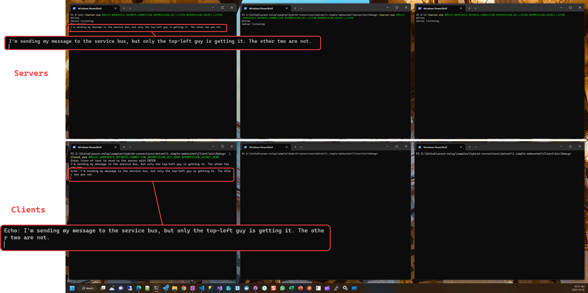

# `Simple` WebSocket Hybrid Connection Sample 

<!-- TOC depthfrom:2 -->

- [`Simple` WebSocket Hybrid Connection Sample](#simple-websocket-hybrid-connection-sample)
  - [Build](#build)
  - [Run](#run)
  - [Scale](#scale)

<!-- /TOC -->


This sample shows how to use the Hybrid Connections API for WebSockets from C#.

It consists of a simple command line client and a simple command line server app. Both applications take the same set of input arguments to launch.
## Build
Updated to Dotnet Framework v4.8. Build like this:


We can also build from command line (see inline below).

Here's the stuff you need on Azure:


## Run

Once you have built the solution, first start the server with 

```server.exe  [ns] [hc] [keyname] [key]```

and then start the client with 

```client.exe  [ns] [hc] [keyname] [key]```

whereby the arguments are as follows:

* [ns] - fully qualified domain name for the Azure Relay namespace, eg. contoso.servicebus.windows.net
* [hc] - name of a previously configured Hybrid Connection (see [main README](../../README.md))
* [keyname] - name of a SAS rule that confers the required right(s). "Listen" is required for the server, "Send" is required for the client. The default management rule confers both.
* [key] - the key for the SAS rules

Example:

```powershell
$ROOT="D:\Github\azure-relay\samples\hybrid-connections\dotnet\1.simple-websocket"
$BUILD="bin\Debug"
$RELAY_NAMESPACE="mdrrahman-dev-relay.servicebus.windows.net"
$HYBRID_CONNECTION="hc-1"
$PERMISSION_KEY_LISTEN="Listen"
$PERMISSION_KEY_SEND="Send"
$PERMISSION_SECRET_LISTEN="Zv...pg="
$PERMISSION_SECRET_SEND="v8...g="

# ======
# Server
# ======
$SERVER="$ROOT\Server"
cd $SERVER

dotnet build

$SERVER_BUILD="$SERVER\$BUILD"
cd $SERVER_BUILD

# Start server - terminal 1
#
.\Server.exe $RELAY_NAMESPACE $HYBRID_CONNECTION $PERMISSION_KEY_LISTEN $PERMISSION_SECRET_LISTEN

# ======
# Client
# ======
$CLIENT="$ROOT\Client"
cd $CLIENT

dotnet build

$CLIENT_BUILD="$CLIENT\$BUILD"
cd $CLIENT_BUILD

# Start client - terminal 2
#
.\Client.exe $RELAY_NAMESPACE $HYBRID_CONNECTION $PERMISSION_KEY_SEND $PERMISSION_SECRET_SEND
```

Once started, the client will connect to the server. You can then enter lines of text which will be sent to the server and returned. A blank line closes the connection.

For example -


Notice how the Server keeps on listening even after the client exits.

## Scale

You can start multiple server instances bound to the same Hybrid Connection to see the effects of the Relay's load balancing capability, as client connections will be distributed across existing listeners, up to 25 concurrent (for a given Server).
 
So for example:




