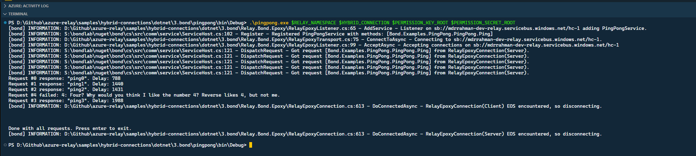
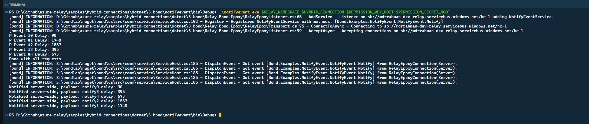

# Bond.Comm Example

<!-- TOC -->

- [Bond.Comm Example](#bondcomm-example)
  - [How to run](#how-to-run)
  - [Example](#example)

<!-- /TOC -->

This folder contains shows how to implement the [Bond Communications](https://microsoft.github.io/bond/manual/bond_comm.html) RPC protocol on top of Hybrid Connections. 

The `Relay.Bond.Epoxy` project is a standalone and reusable implementation of the [Bond Epoxy](https://microsoft.github.io/bond/manual/bond_comm_epoxy.html) TCP transport that uses the Azure Relay service instead of plain TCP.

Alongside the alternate transport, there are two samples included here that have been adapted from the Bond Comm sample set:

* `pingpong` - a simple request/response service
* `notifyevent` - a one-way notification service

The key difference between these samples and the base samples is that they use the new transport, so instead of the ```EpoxyTransportBuilder``` (and related classes) they use 
the ```RelayExpoxyTransportBuilder``` and equivalent "Relay"-prefixed classes.

```csharp
var transport = new RelayEpoxyTransportBuilder(tokenProvider)
    .SetLogSink(new ConsoleLogger())
    .Construct();

var pingPongService = new PingPongService();
RelayEpoxyListener pingPongListener = transport.MakeListener(address);
pingPongListener.AddService(pingPongService);
```

The `tokenProvider` for the underlying ```HybridConnectionClient``` and ```HybridConnectionListener``` is passed into the ```RelayEpoxyTransportBuilder```. Instead of IP addresses (or ostnames) and ports,
addresses are Relay URIs for Hybrid Connections.

## How to run

Both samples accept four positional command line parameters in this order:
1. Fully qualified namespace name, e.g. 'myns.servicebus.windows.net'
2. Name of the Hybrid Connection to use, e.g. 'hyco'
3. Name of a SAS rule with listen and send permission, e.g. 'RootManageSharedAccessKey'
4. Key value for the chosen SAS rule

Example:

```bash
pingpong.exe myns.servicebus.windows.net hyco RootManageSharedAccessKey fNuEFnLHvSklCfSiSbrbd3bliTJbfi6dhbP2tMsnWSs=
```

## Example

```powershell
$ROOT="D:\Github\azure-relay\samples\hybrid-connections\dotnet\3.bond"
$BUILD="bin\Debug"
$RELAY_NAMESPACE="mdrrahman-dev-relay.servicebus.windows.net"
$HYBRID_CONNECTION="hc-1"
$PERMISSION_KEY_LISTEN="Listen"
$PERMISSION_KEY_SEND="Send"
$PERMISSION_KEY_ROOT="RootManageSharedAccessKey"
$PERMISSION_SECRET_LISTEN="Zv...g="
$PERMISSION_SECRET_SEND="v8...wg="
$PERMISSION_SECRET_ROOT="0X...s="

# =========
# Ping pong
# =========
$PINGPONG="$ROOT\pingpong"
cd $PINGPONG

dotnet build

$PINGPONG_BUILD="$PINGPONG\$BUILD"
cd $PINGPONG_BUILD

# Start pingpong
#
.\pingpong.exe $RELAY_NAMESPACE $HYBRID_CONNECTION $PERMISSION_KEY_ROOT $PERMISSION_SECRET_ROOT

# ============
# Notify Event
# ============
$NOTIFYEVENT="$ROOT\notifyevent"
cd $NOTIFYEVENT

dotnet build

$NOTIFYEVENT_BUILD="$NOTIFYEVENT\$BUILD"
cd $NOTIFYEVENT_BUILD

# Start pingpong
#
.\notifyevent.exe $RELAY_NAMESPACE $HYBRID_CONNECTION $PERMISSION_KEY_ROOT $PERMISSION_SECRET_ROOT
```

Pingpong:



Notify Event:



> Basically, looks like a promotion to use Bond for comms patterns.